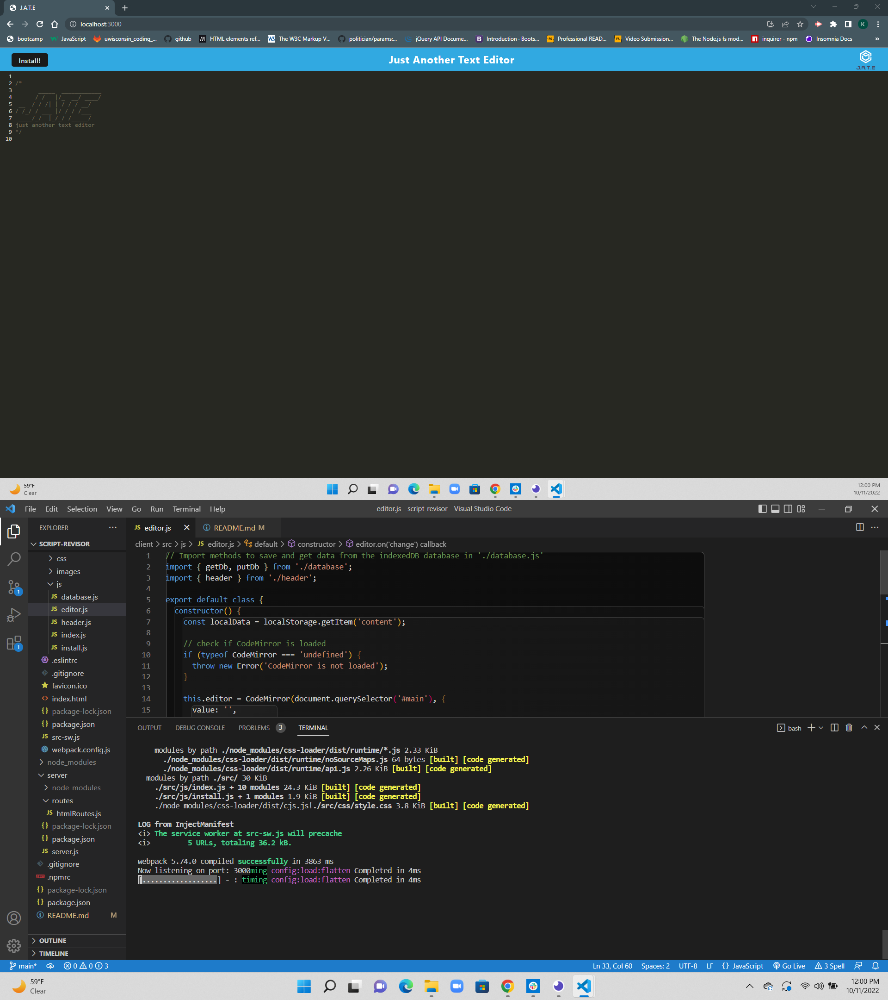

# Script Revisor

Allows you to write any notes or snippets of code with/without internet connection. IndexedDB is initially used to find data stored but if that can't be accessed then this application will use local storage. 

## Built with

* Express 
* Node.js
* Webpack
* IndexedDb
* Javascript

## Screenshot

## Heroku Deployed Link
https://calm-castle-89895.herokuapp.com/
